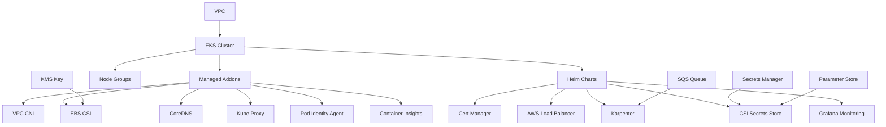

# Architecture & Design Documentation

## Overview

This AWS EKS infrastructure project implements a production-ready Kubernetes cluster with comprehensive observability, security, and operational capabilities. The architecture follows AWS Well-Architected Framework principles and implements infrastructure-as-code using AWS CDK.

## High-Level Architecture

```
┌─────────────────────────────────────────────────────────────────┐
│                        AWS Account                               │
│                                                                 │
│  ┌─────────────────────────────────────────────────────────┐    │
│  │                    VPC (10.0.0.0/16)                   │    │
│  │                                                         │    │
│  │  ┌─────────────┐  ┌─────────────┐  ┌─────────────┐     │    │
│  │  │ Public AZ-A │  │ Public AZ-B │  │ Public AZ-C │     │    │
│  │  │10.0.1.0/24  │  │10.0.2.0/24  │  │10.0.3.0/24  │     │    │
│  │  │             │  │             │  │             │     │    │
│  │  │  NAT GW     │  │  NAT GW     │  │             │     │    │
│  │  └─────────────┘  └─────────────┘  └─────────────┘     │    │
│  │                                                         │    │
│  │  ┌─────────────┐  ┌─────────────┐  ┌─────────────┐     │    │
│  │  │Private AZ-A │  │Private AZ-B │  │Private AZ-C │     │    │
│  │  │10.0.4.0/24  │  │10.0.5.0/24  │  │10.0.6.0/24  │     │    │
│  │  │             │  │             │  │             │     │    │
│  │  │ EKS Nodes   │  │ EKS Nodes   │  │ EKS Nodes   │     │    │
│  │  │ Karpenter   │  │ Karpenter   │  │ Karpenter   │     │    │
│  │  └─────────────┘  └─────────────┘  └─────────────┘     │    │
│  │                                                         │    │
│  │         ┌─────────────────────────────────┐             │    │
│  │         │       EKS Control Plane        │             │    │
│  │         │     (Managed by AWS)           │             │    │
│  │         └─────────────────────────────────┘             │    │
│  └─────────────────────────────────────────────────────────┘    │
│                                                                 │
│  ┌─────────────────────────────────────────────────────────┐    │
│  │                 External Services                       │    │
│  │                                                         │    │
│  │  • AWS Secrets Manager                                 │    │
│  │  • AWS Systems Manager Parameter Store                 │    │
│  │  • Amazon CloudWatch                                   │    │
│  │  • AWS X-Ray                                          │    │
│  │  • Amazon SQS (Karpenter Interruption)               │    │
│  │  • AWS KMS (EBS Encryption)                           │    │
│  │  • Grafana Cloud                                      │    │
│  └─────────────────────────────────────────────────────────┘    │
└─────────────────────────────────────────────────────────────────┘
```

## Core Components

### 1. Networking Layer (VPC)

- **VPC**: 10.0.0.0/16 CIDR with IPv4-only support
- **Availability Zones**: 3 AZs for high availability
- **Public Subnets**: /24 per AZ, hosts NAT Gateways and Load Balancers
- **Private Subnets**: /24 per AZ, hosts EKS worker nodes
- **NAT Gateways**: 2 for redundancy and cost optimization
- **Internet Gateway**: Enables outbound internet access

### 2. EKS Control Plane

- **Version**: Kubernetes 1.33
- **Endpoint Access**: Public and Private (hybrid mode)
- **Logging**: All log types enabled (API, Audit, Authenticator, Controller Manager, Scheduler)
- **Authentication**: Integration with AWS IAM and RBAC

### 3. Compute Layer

#### Managed Node Groups
- **AMI**: Bottlerocket (bottlerocket_x86_64) - Security-focused container OS
- **Instance Types**: m5a.large (configurable instance class and size)
- **Capacity**: On-demand instances (2 min, 6 max, 2 desired)
- **Subnets**: Deployed in private subnets only
- **Security**: SSM managed instances for secure access

#### Karpenter Auto-scaling
- **Dynamic Provisioning**: Just-in-time node provisioning using Pod Identity
- **Cost Optimization**: Right-sized instances based on pod requirements
- **Interruption Handling**: SQS integration (`{{hosted:id}}-karpenter` queue) for spot instance interruptions
- **Multi-AZ**: Distributes workloads across availability zones
- **Node Selection**: Targets core nodes for Karpenter pod placement

### 4. Security Layer

#### Identity and Access Management
- **Pod Identity**: EKS Pod Identity Agent for IRSA
- **Service Accounts**: Dedicated service accounts with minimal permissions
- **RBAC**: Kubernetes Role-Based Access Control
- **AWS IAM**: Integration with AWS Identity Center (SSO)

#### Network Security
- **Security Groups**: Automatic creation and management by EKS
- **NACLs**: Default VPC network ACLs
- **Private Networking**: Worker nodes in private subnets only

#### Data Encryption
- **EBS Volumes**: KMS encryption at rest
- **Secrets**: AWS Secrets Manager and Parameter Store integration
- **Transit**: TLS encryption for all communications

### 5. Storage Layer

- **Default Storage Class**: EBS CSI driver with GP3 volumes
- **KMS Encryption**: Dedicated KMS key for EBS volume encryption
- **Dynamic Provisioning**: Automatic PV creation via CSI
- **Backup**: Configurable snapshot policies

### 6. Observability Stack

#### Monitoring
- **CloudWatch Container Insights**: Container and application metrics
- **Grafana Cloud**: Advanced visualization and alerting
- **Prometheus**: Metrics collection and storage
- **AWS X-Ray**: Distributed tracing

#### Logging
- **CloudWatch Logs**: EKS control plane and application logs
- **Fluent Bit**: Log collection and forwarding
- **Structured Logging**: JSON format for searchability

## Resource Relationships

### CDK Stack Structure

```
DeploymentStack (Root)
├── NetworkNestedStack
│   ├── VPC
│   ├── Subnets (Public/Private)
│   ├── NAT Gateways
│   ├── Internet Gateway
│   └── Route Tables
└── EksNestedStack
    ├── EKS Cluster
    ├── Managed Node Groups
    ├── AWS Managed Addons
    ├── Helm Chart Addons
    ├── IAM Roles and Policies
    ├── KMS Keys
    └── SQS Queues
```

### Service Dependencies



## Design Principles

### 1. Security First
- **Principle of Least Privilege**: Each component has minimal required permissions
- **Defense in Depth**: Multiple layers of security controls
- **Encryption Everywhere**: Data encrypted at rest and in transit
- **Zero Trust**: No implicit trust between components

### 2. High Availability
- **Multi-AZ Deployment**: Resources distributed across 3 availability zones
- **Redundant Components**: Multiple NAT Gateways and load balancers
- **Auto-scaling**: Dynamic scaling based on demand
- **Health Checks**: Automated health monitoring and recovery

### 3. Operational Excellence
- **Infrastructure as Code**: All resources defined in CDK
- **Observability**: Comprehensive monitoring, logging, and tracing
- **Automation**: Self-healing and auto-scaling capabilities
- **Documentation**: Extensive documentation and runbooks

### 4. Cost Optimization
- **Right-sizing**: Karpenter for optimal instance selection
- **Spot Instances**: Support for spot instances where appropriate
- **Resource Tagging**: Comprehensive tagging for cost allocation
- **Monitoring**: Cost tracking and optimization recommendations

### 5. Performance Efficiency
- **Horizontal Scaling**: Auto-scaling at both node and pod levels
- **Efficient Networking**: Optimized VPC and subnet design
- **Storage Performance**: GP3 volumes with configurable IOPS
- **Caching**: Strategic use of caching at multiple layers

## Configuration Management

### Template-Based Configuration
- **Mustache Templates**: Parameterized configuration files
- **Environment Separation**: Different configurations per environment
- **Version Control**: All configurations tracked in Git
- **Validation**: Automated validation of configuration changes

### Deployment Patterns
- **Blue/Green**: Support for blue/green deployments
- **Rolling Updates**: Controlled rolling updates for node groups
- **Canary Releases**: Gradual rollout of new versions
- **Rollback**: Quick rollback capabilities

## Integration Points

### AWS Services
- **IAM**: Identity and access management
- **CloudFormation**: Infrastructure provisioning
- **CloudWatch**: Monitoring and alerting
- **Secrets Manager**: Secrets management
- **Parameter Store**: Configuration management
- **KMS**: Encryption key management
- **SQS**: Message queuing for interruptions

### External Services
- **Grafana Cloud**: Advanced observability
- **Certificate Authorities**: TLS certificate management
- **Container Registries**: Docker image storage
- **CI/CD Systems**: Deployment automation

## Scalability Considerations

### Horizontal Scaling
- **Pod Autoscaling**: HPA and VPA support
- **Node Autoscaling**: Cluster Autoscaler and Karpenter
- **Load Balancing**: Application Load Balancer integration
- **Service Mesh**: Ready for service mesh integration

### Vertical Scaling
- **Instance Types**: Wide range of instance type support
- **Resource Limits**: Configurable resource limits and requests
- **Performance Monitoring**: Continuous performance optimization
- **Capacity Planning**: Data-driven capacity planning

## Disaster Recovery

### Backup Strategy
- **EBS Snapshots**: Automated volume snapshots
- **Configuration Backup**: CDK code in version control
- **State Management**: Terraform/CDK state backup
- **Application Data**: Application-specific backup strategies

### Recovery Procedures
- **RTO/RPO**: Defined recovery time and point objectives
- **Cross-Region**: Support for cross-region disaster recovery
- **Automated Recovery**: Automated disaster recovery procedures
- **Testing**: Regular disaster recovery testing